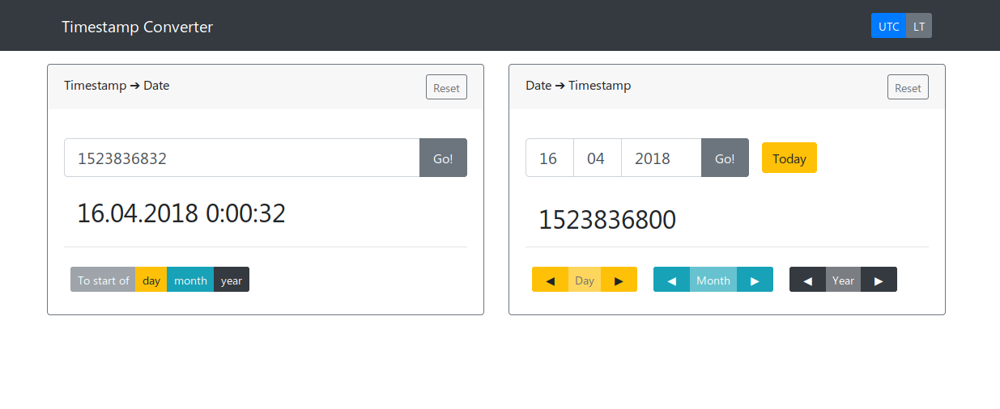

# TimestampConverter

## Todo
- [ ] Dorobienie ustawień, które będą zapisywać się w local storage (np. historia wpisywanych timestampów, ustawienie LT/UTC, format "wyjściowy"(kropki czy kreski w 2018.01.01))
